## 0. Introduction
In this tutorial, we will show how to use deepEA (https://deepea.nwafu.edu.cn or http://39.101.176.205:4006) to perform comprehensive m6A sequencing data analysis. The m6A -immunoprecipitated (IP) and input (non-IP) samples with two biological replicates were extracted from the 14-day-old seedlings of maize (*Zea mays* L.) inbred lines B73, and then sequenced with high-throughput sequencing technology. The SRA accessions of four datasets are listed in the following table. The More information regarding these maize m6A sequencing datasets is available in the reference (<a href="http://www.plantphysiol.org/content/182/1/332" target="_blank">Luo <I>et al</I>., 2020</a>).

|  Samples   | **Experiments** | Replicates  |
| :--------: | :-------------: | :---------: |
| SRR8383013 |       IP        | Replicate 1 |
| SRR8383014 |       IP        | Replicate 2 |
| SRR8383017 |      input      | Replicate 1 |
| SRR8383018 |      input      | Replicate 2 |
## 1. Download *Zea mays* reference genome sequences and annotation

Before analyzing m6A sequencing data, we firstly use the function **Obtain Genome Sequences and Annotation** in **Data Preparation** module to download *Zea mays* B73 reference genome sequences and GTF annotation, the following two screenshots shows details about how to execute this step:

#### Step 1: download *Zea mays* reference genome sequences in FASTA format

#### Step 2: download *Zea mays* genome annotation file in GTF format

After that, reference genome sequences (named as **zea_mays_release-47_Genome.txt**) and annotation (named as **zea_mays_release-47_GTF.txt**) will be listed in your History Panel.

## 2. Download raw m6A sequencing reads

After finishing downloading *Zea mays* B73 reference genome sequences and annotation, we start to download raw m6A sequencing reads from NCBI SRA's database, this process can be finished by the function **Obtain Epitranscriptome Sequencing Reads** in **Data Preparation** module. Please see the following screenshots for details:

#### Step 1: download IP sample for biological replicate 1 (SRR8383013)

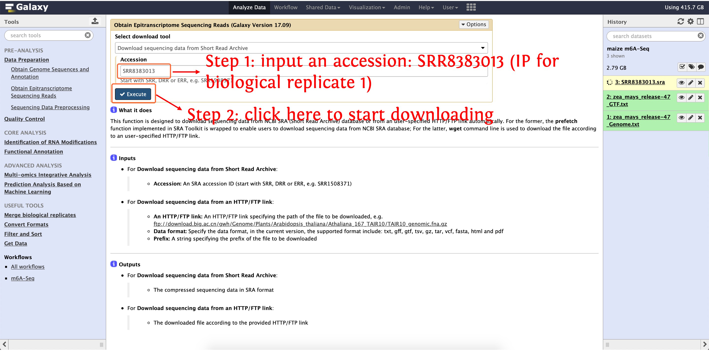

#### Step 2: download IP sample for biological replicate 2 (SRR8383014)
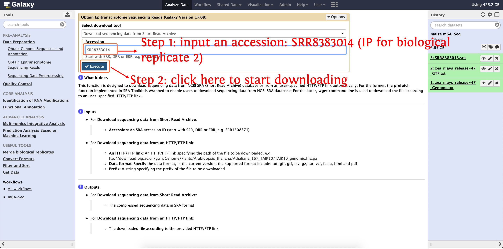

#### Step 3: download input sample for biological replicate 1 (SRR8383017)

#### Step 4: download input sample for biological replicate 2 (SRR8383018)
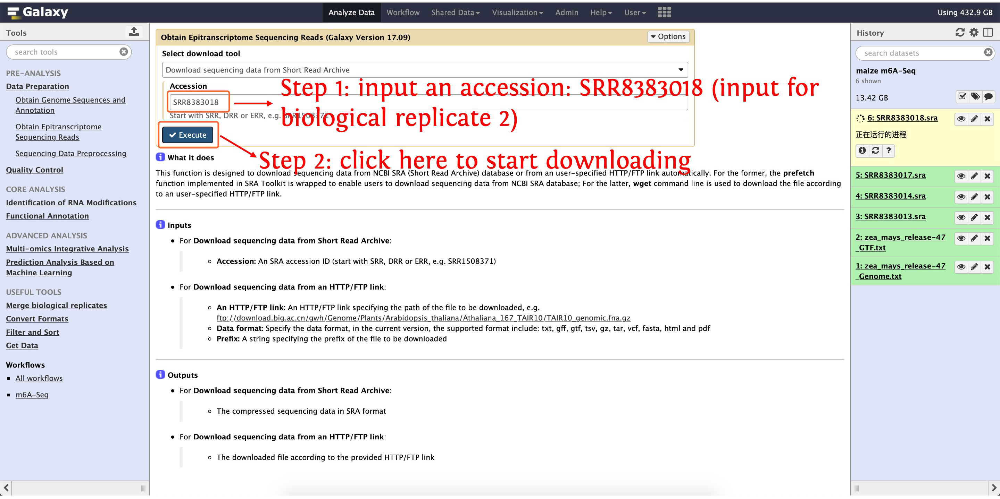

After finishing the above four steps, four raw m6A sequencing reads named as **SRR8383013.sra, SRR8383013.sra, SRR8383013.sra, SRR8383013.sra**, respectively will be listed in your History Panel

## 3. Convert raw m6A sequencing reads from SRA to FASTQ format

Here, let's convert raw m6A sequencing reads from SRA to FASTQ format by the function **Sequencing Data Preprocessing** in **Data Preparation** module, please see the following four screenshots for details:

#### Step 1: process SRR8383013.sra
This step will cost ~12 minutes
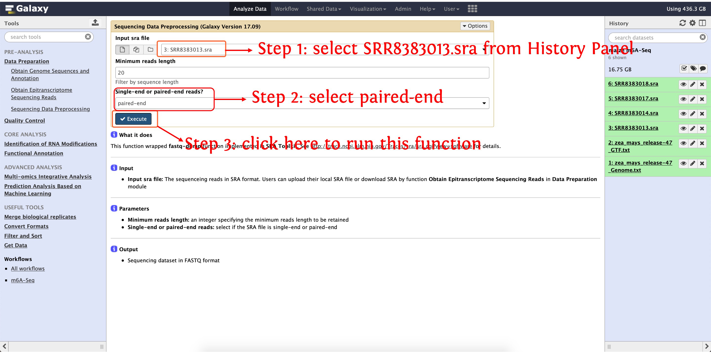

#### Step 2: process SRR8383014.sra
This step will cost ~26 minutes

#### Step 3: process SRR8383017.sra
This step will cost ~24 minutes
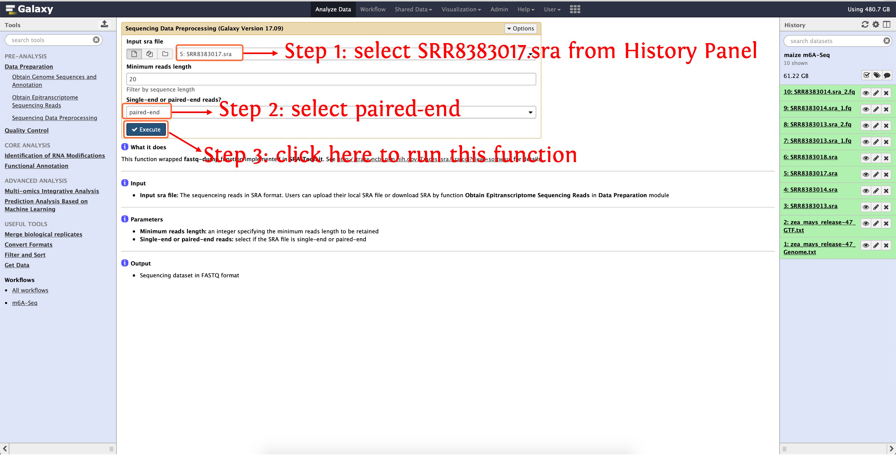

#### Step 4: process SRR8383018.sra
This step will cost ~23 minutes
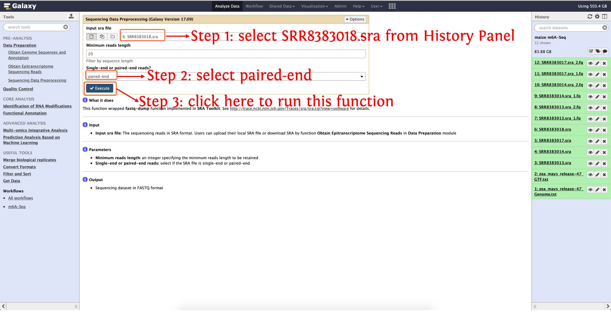

For each SRA accession, two FASTQ format files (forward reads and reverse reads) will be generated as this experiment is paired-end sequencing.

## 4. Trim raw m6A sequencing reads

Before align m6A sequencing reads to genome, trim low-quality reads is necessary in all NGS (Next Generation Sequencing) analyses as which may cause incorrect mapping of reads to a reference genome, and even result in incorrect identification of RNA modifications. deepEA provided the function **Assess Reads Quality** in **Quality Control** module to filter raw reads to clean reads, please see the following screenshots for details:

#### Step 1: trim SRR8383013
This step will cost ~16 minutes
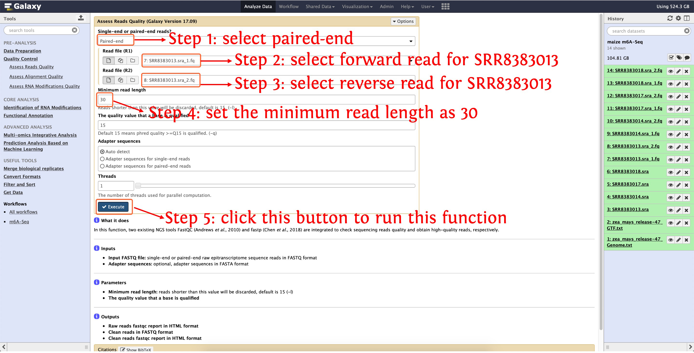

#### Step 2: trim SRR8383014
This step will cost ~12 minutes

#### Step 3: trim SRR8383017
This step will cost ~13 minutes

#### Step 4: trim SRR8383018
This step will cost ~12 minutes

For each SRA accession, three files will be output, please see the following screenshot for detail:

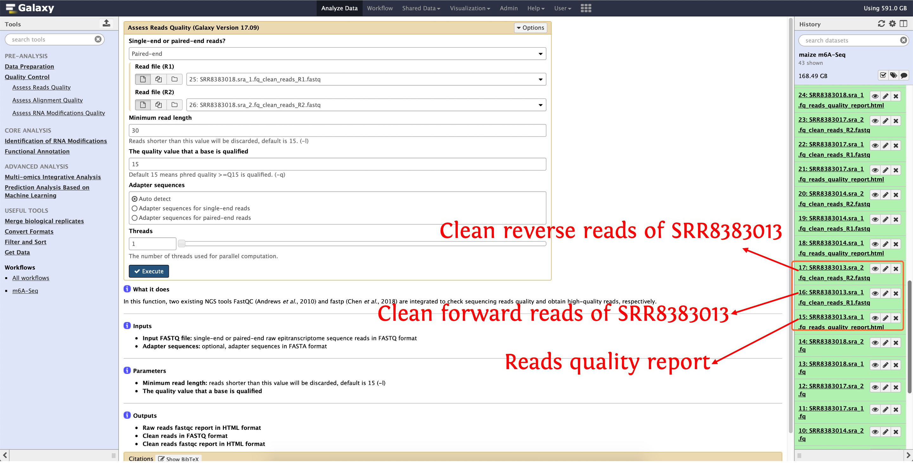

## 5. Align clean m6A sequencing reads to *Zea mays* B73 reference genome with HISAT2

Here, we start to align clean reads to reference genome with HISAT2 provided in module **Identification of RNA Modifications**, see the following screenshots for details:

#### Step 1: align SRR8383013
This step will cost ~48 minutes

#### Step 2: align SRR8383014
This step will cost ~40 minutes

#### Step 3: align SRR8383017
This step will cost ~44 minutes
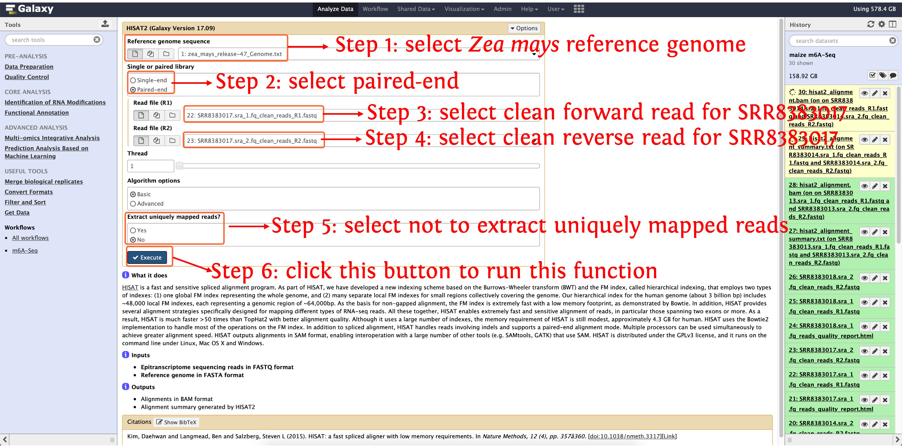

#### Step 4: align SRR8383018
This step will cost ~42 minutes
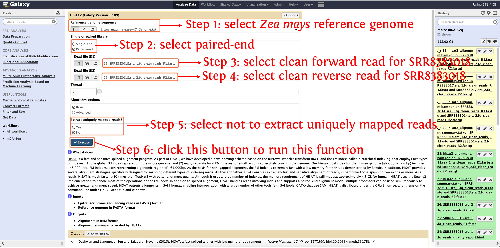

Then for each SRA accession, reads-genome alignments in BAM format and alignment summary will be generated, see the following screenshot:
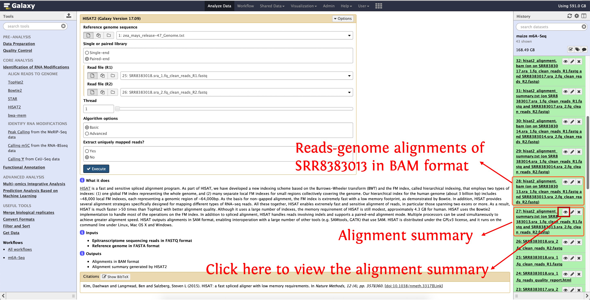

## 6. Call m6A enriched peaks with macs2

After finishing aligning reads to genome, let's start to call m6A enriched peaks with macs2, the following screenshots show details about parameter settings:

#### Step 1: call m6A peaks for biological replicate 1
This step will cost ~8 minutes

This step will generate ~16,400 peaks for biological replicate 1

#### Step 2: call m6A peaks for biological replicate 2
This step will cost ~7 minutes
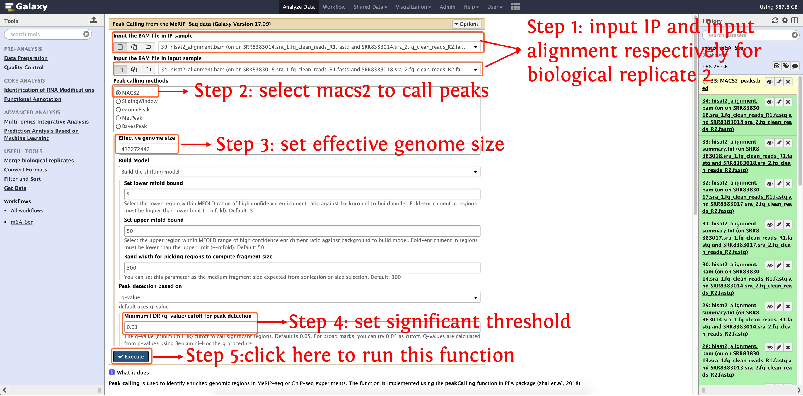

This step will generate ~16,100 peaks for biological replicate 2

#### Step 3: obtain consistent peaks between two biological replicates

After finishing peak calling for two replicates, deepEA also provided a function **Merge two biological replicates** to obtain consistent peaks between two biological replicates, see the following screenshots for details:

This step will cost ~2 seconds

Then the consistent peaks named as **intersect.bed** (about ~14,000 consistent peaks) will be shown in your History Panel.

## 7. Perform functional annotation for m6A
#### m6A distribution

The distribution of m6A  in the genome and transcriptome can be visualized by the function **RNA Modification Distribution** in **Functional Annotation** module, see the following screenshot for detail:

This step will cost ~5 minutes

Then an interactively HTML will be generated, please see <a href="http://39.101.176.205:4006/static/demo/RNA_modifications_distribution.html" target="_blank">here</a> to preview this results

#### Link m6A modifications with genes
This step will cost ~2 minutes

This output for this function are shown in the following the screenshot

#### *De-novo* motif discovery
This following screenshot shows how to use homer to perform *de-novo* motif discovery

This step will cost ~6 minutes
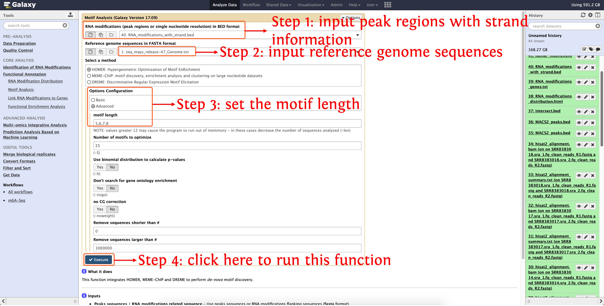

Then an HTML document will be generated, please click <a href="http://39.101.176.205:4006/static/demo/homer_motifs.html" target="_blank">here</a> to preview this results

#### GO functional enrichment analysis
deepEA provided the function **Functional Enrichment Analysis** to perform GO enrichment analysis, see the following screenshot for detail:

This step will cost ~1 minute
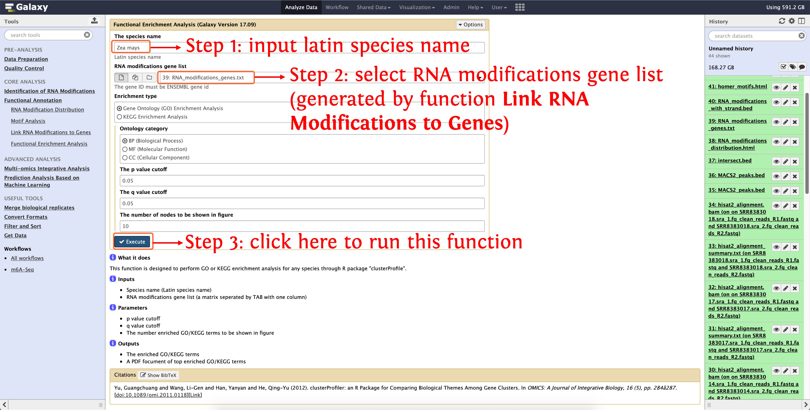

Then a figure in PDF format and a TAB separated matrix will be generated, please click  <a href="http://39.101.176.205:4006/static/demo/GO_enrichment.pdf" target="_blank">here</a>   for details.

## 7. Multi-omics integrative analysis

To run this module, you have to download test data provided by deepEA, and then upload the data in directory `test_data/Multi-omics Integrative Analysis/` to deepEA server. If you are not sure how to upload local data into deepEA server, please see <a href="https://www.youtube.com/watch?reload=9&v=vDd9yQHiYYQ" target="_blank">here</a> for details. Then you can run the function **Integrative Analysis of Three Omics Data Sets** in **Multi-omics Integrative Analysis** module as the following screenshot shows:

This step will cost ~6 seconds

Then an interactively HTML document will be output, click <a href="http://39.101.176.205:4006/static/demo/multi-omics.html" target="_blank">here</a>  to preview this results.

## 8. Build an m6A predictor based on machine learning
The following four steps shows us how to use **Prediction Analysis Based on Machine Learning** module to build an m6A predictor and perform cross-validation experiments.

#### Step 1: generate positive and negative samples for m6A predictor construction
The function **Sample Generation** can be used to generate positive and negative samples.

This step will cost **~5 hours**, please wait patiently
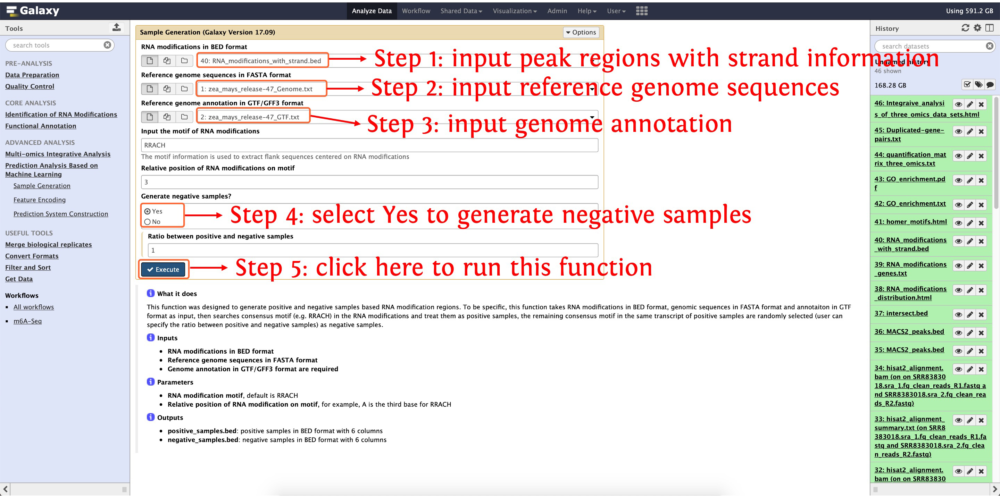

#### Step 2: encoding positive samples by function Feature Encoding
This step will cost ~13 minutes
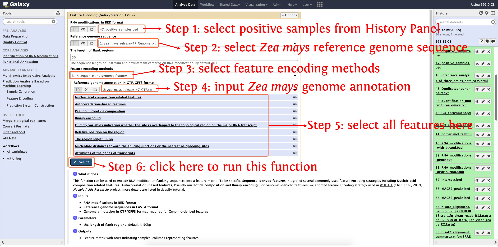

#### Step 3: encoding negative samples by function Feature Encoding
This step will cost ~13 minutes
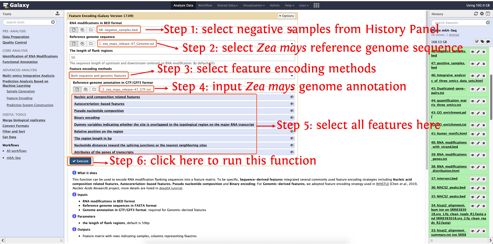

#### Step 4: m6A predictor construction and evaluation
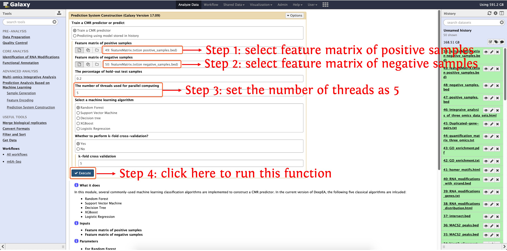

After finishing predictor construction and evaluation, three documents will be output, please see the following screenshot:
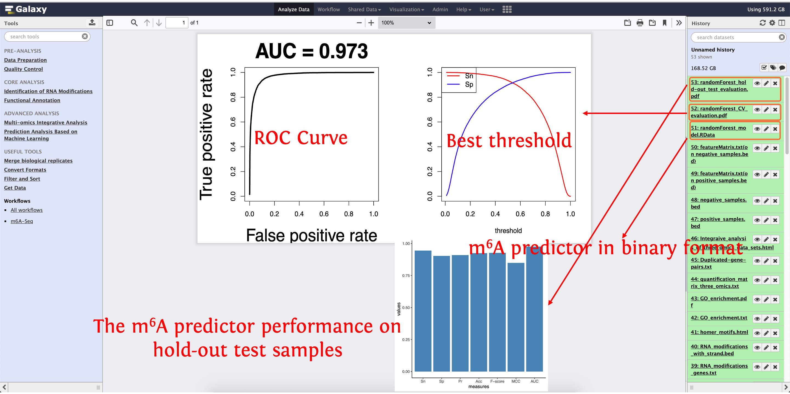

## 9. Predict candidate m6A using the m6A predictor

After building an m6A predictor, we can use the predictor to prioritize candidate m6 modifications, to do this, you have to prepare a file in BED format, see the following table:

| Chr  | Start | End   | GeneID         | NA   | Strand |
| ---- | ----- | ----- | -------------- | ---- | ------ |
| 1    | 49625 | 49751 | Zm00001d027230 | .    | +      |
| 1    | 50925 | 51026 | Zm00001d027231 | .    | -      |
| 1    | 92303 | 92526 | Zm00001d027232 | .    | -      |

Then upload this file into deepEA server and run the function **Sample Generation** in **Prediction Analysis Based on Machine Learning** module as the following screenshot shows:

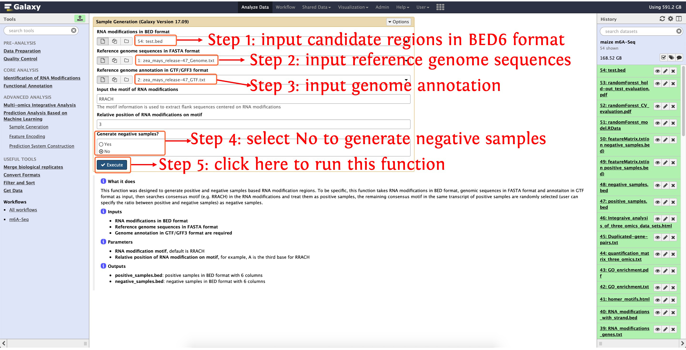

Then encoding the candidate samples using the same feature encoding methods as m6A predictor construction:

After encoding the candidate samples, we can predict the candidate m6A:
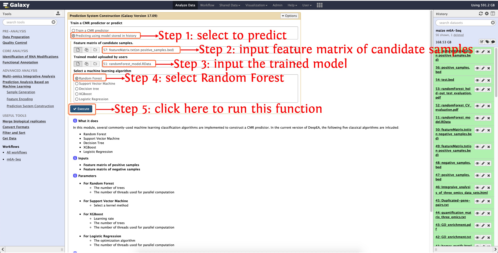

