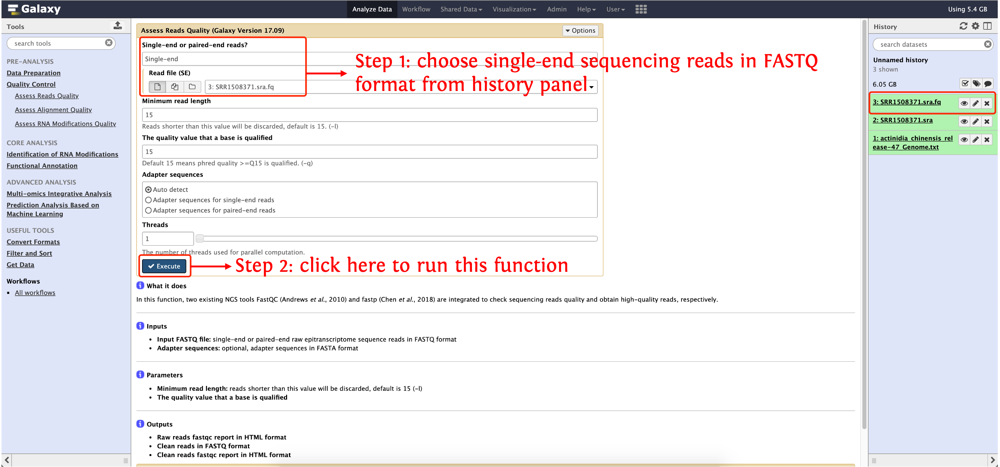
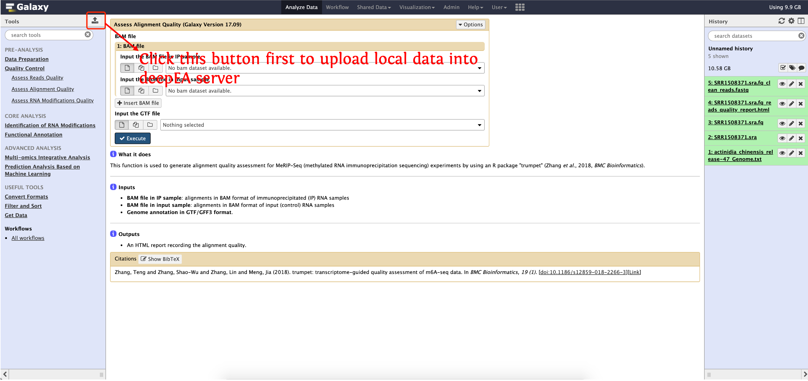
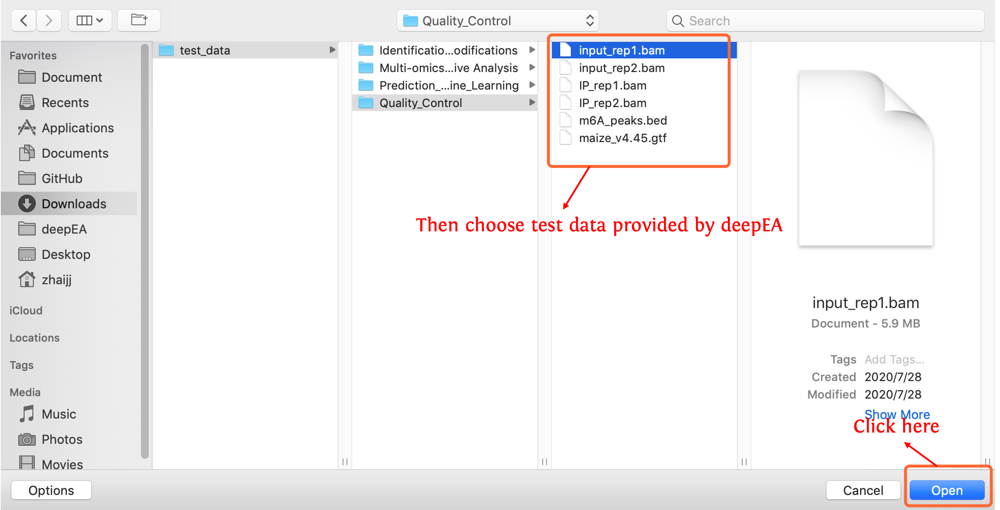
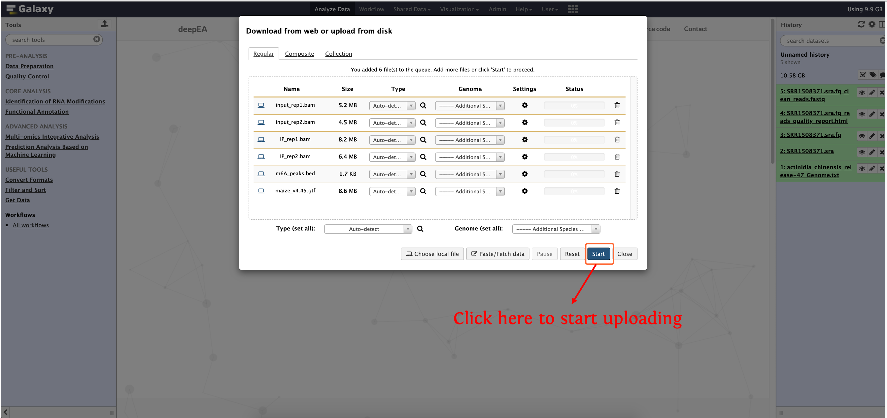
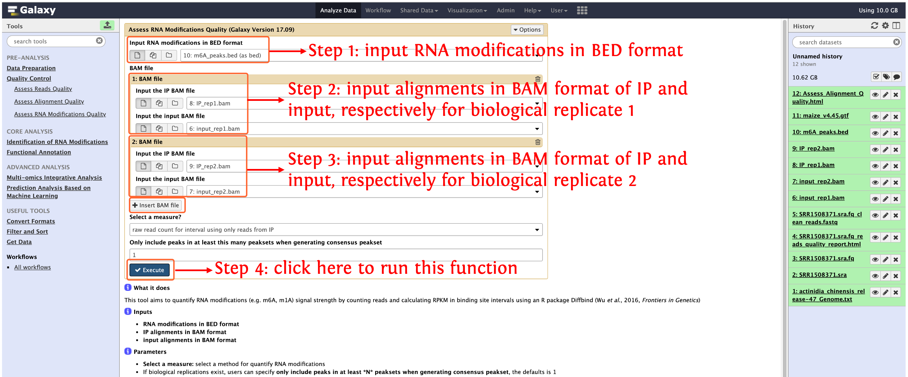

<strong>deepEA User Manual</strong>

(version 1.0)

- deepEA is a convenient, freely available, web-based platform that is capable to support deep analysis of epitranscriptome sequencing data with several general and specific functionalities. deepEA consists of six modules: **Data Preparation, Quality Control, Identification of RNA Modifications, Functional Annotation, Multi-omics Integrative Analysis and Prediction Analysis Based on Machine Learning**. 
- deepEA project is hosted on https://cma2015.github.io/deepEA. 
- The deepEA demo server can be accessed via http://deepea.omicstudio.cloud.
- The following part shows installation of deepEA docker image and detailed documentation for each function in deepEA.

## Quality Control

**Quality Control** module consists of a suite of tools focused on different levels of quality assessment, including reads quality, alignment quality and RNA modifications quality, Thus, three functions are implemented, including **Assess Reads Quality**, **Assess Alignment Quality** and **Assess RNA modifications Quality**. The details of as follows:

| **Tool**                             | **Description**                                              | **Input**                                                    | **Output**                                                   | **Time (test data)** | **Programs**                                                 | **Reference**                                                |
| ------------------------------------ | ------------------------------------------------------------ | ------------------------------------------------------------ | ------------------------------------------------------------ | -------------------- | ------------------------------------------------------------ | ------------------------------------------------------------ |
| **Assess Reads Quality**             | This function firstly performs quality control using FastQC and then trims low-quality reads using fastp | Epitranscriptome sequencing reads in FASTQ format            | Clean reads in FASTQ format; Reads quality report in HTML format | ~40s                 | <a href="https://www.bioinformatics.babraham.ac.uk/projects/fastqc" target="_blank">FastQC</a>,<a href="https://github.com/OpenGene/fastp" target="_blank">fastp</a> | <a href="https://doi.org/10.1093/bioinformatics/bty560" target="_blank">Chen <I>et al</I>., 2018, Bioinformatics</a>,<a href="https://www.bioinformatics.babraham.ac.uk/projects/fastqc" target="_blank">Babraham Bioinformatics</a> |
| **Assess Alignment Quality**         | Assess the quality of read-genome alignments (here reads from MeRIP-Seq experiments) | Reads alignments in SAM/BAM format                           | Alignment quality report in HTML format                      | ~1 min               | <a href="https://github.com/skyhorsetomoon/Trumpet" target="_blank">trumpet</a>         | <a href="https://bmcbioinformatics.biomedcentral.com/articles/10.1186/s12859-018-2266-3" target="_blank">Zhang <I>et al</I>., 2018, BMC Bioinformatics</a> |
| **Assess RNA Modifications Quality** | Quantify RNA modifications signal strength by counting reads and calculating RPKM | RNA modifications in BED format and read alignments in SAM/BAM format | RNA modifications quantification matrix in HTML format       | ~1 min               | <a href="https://bioconductor.org/packages/release/bioc/html/DiffBind.html" target="_blank">DiffBind</a> | <a href="https://www.frontiersin.org/articles/10.3389/fgene.2015.00169/full" target="_blank">Wu <I>et al</I>., 2016, Frontiers in Genetics</a> |

## Assess Reads Quality

In this function, two existing NGS tools **FastQC** (Andrews *et al*., 2010) and **fastp** (Chen *et al*., 2018) are integrated to check sequencing reads quality and obtain high-quality reads, respectively.

#### Input

- **Input FASTQ file**: single-end or paired-end raw epitranscriptome sequence reads in FASTQ format
- **Adapter sequences**: optional, adapter sequences in FASTA format

#### Output

- **Clean reads in FASTQ format**
- **Reads quality report in HTML format**

#### How to use this function
- The following screenshot shows us how to assess reads quality

	

## Assess Alignment Quality

This function is used to generate alignment quality assessment for MeRIP-Seq (methylated RNA immunoprecipitation sequencing) experiments by using an R package "trumpet" (Zhang *et al*., 2018, *BMC Bioinformatics*).

#### Input

- **BAM file in IP sample**: alignments in BAM format of immunoprecipitated (IP) RNA samples
- **BAM file in input sample**: alignments in BAM format of input (control) RNA samples
- **Genome annotation in GTF/GFF3 format**

#### Output

- An HTML report recording the alignment quality.

#### How to use this function
- **Step 1**: download test data provided by deepEA (https://deepea.nwafu.edu.cn/static/test_data.zip)

- **Step 2**: upload test data in directory `test_data/Quality_Control/` to history panel

- **Step 3**: input the corresponding file as the following screenshot shows to run this function:

	

## **Assess RNA Modifications Quality**

This tool aims to quantify RNA modifications (e.g. m6A, m1A) signal strength by counting reads and calculating RPKM in binding site intervals using an R package Diffbind (Wu *et al*., 2016, *Frontiers in Genetics*)

#### Input

- **RNA modifications in BED format** 
- **IP alignments in BAM format**
- **input alignments in BAM format**

#### Output

- An interactive HTML document recording each RNA modification region's RPKM

#### How to use this function
- Please see the following screenshots to run this function, test data used in the screenshot is available in `test_data/Quality_Control/`

	
