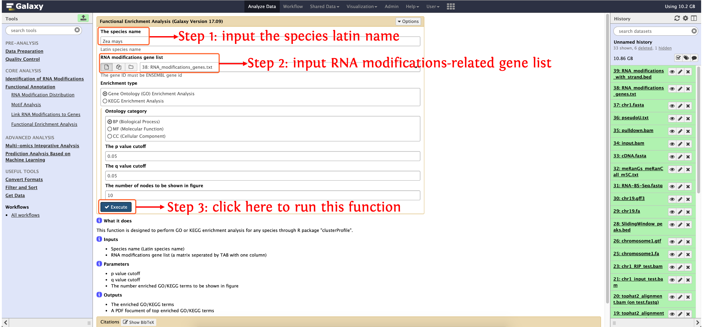

## 0. Introduction for Functional Annotation

This module provided four functions to perform functional annotation of RNA modifications

| **Functions**                       |                       **Description**                        |                          **Input**                           |                          **Output**                          | Time  (test data) |                        **Reference**                         |
| ----------------------------------- | :----------------------------------------------------------: | :----------------------------------------------------------: | :----------------------------------------------------------: | ----------------- | :----------------------------------------------------------: |
| **RNA Modification Distribution**   | Visualize the distribution of RNA modifications in the genome and transcriptome, including the number of peaks in genomic features, the regions of enrichment of RNA modifications within transcripts, the enrichment of RNA modifications around transcriptional start/stop site and the enrichment of RNA modifications around splicing sites | RNA modifications in BED format and genome annotation in GTF/GFF3 format | Comprehensive overview of RNA modifications distribution in HTML or PDF format | ～1 min           |                       In-house scripts                       |
| **Motif Analysis**                  | Integrate MEME-ChIP and DREME to perform de-novo motif discovery | RNA modifications in BED format and reference genome sequences in FASTA format |               Discovered motifs in HTML format               | ~4s               | <a href="https://academic.oup.com/bioinformatics/article/27/12/1653/257754" target="_blank">Timothy <I>et al</I>., 2011, Bioinformatics</a>,<a href="https://academic.oup.com/bioinformatics/article/27/12/1696/255896" target="_blank">Philip <I>et al</I>., 2011, Bioinformatics</a>,<a href="https://doi.org/10.1016/j.molcel.2010.05.004" target="_blank">Heinz <I>et al</I>., 2010, Molecular Cell</a> |
| **Link RNA Modifications to Genes** | Link RNA modifications to nearest genes based on genomic coordinate | RNA modifications in BED format and genome annotation in GTF/GFF3 format |           Detailed RNA modifications-related genes           | ~5s               |                       In-house scripts                       |
| **Functional Enrichment Analysis**  |    Perform GO or KEGG enrichment analysis for any species    |                          Gene list                           |                  The enriched GO/KEGG terms                  | ~6 mins           | <a href="https://doi.org/10.1089/omi.2011.0118" target="_blank">Yu <I>et al</I>., 2012, OMICS</a> |

## 1. **RNA Modification Distribution**

This function is designed to provide insights into spatial and functional associations of RNA modifications. This function takes the RNA modifications in BED format and genome annotation in GTF (Gene Transfer Format) format as input, then the manner of distribution of RNA modifications in the genome and transcriptome is statistically analyzed and visualized, including the number of peaks in genomic feature (e.g. promoter, exon, intron, etc), the regions of enrichment of RNA modifications within transcripts, the enrichment of RNA modifications in transcriptional start/stop site and the enrichment of RNA modifications in splicing sites.

#### Input

- **RNA modifications:** RNA modifications in BED format
- **Genome annotation in GTF/GFF3 format:** The genome annotation in GTF/GFF3 format

#### Output

- Both html report and PDF version are available

#### How to use this function

- **Step 1**: if you don't run the **Quality Control** module, please upload RNA modifications in BED format is in `test_data/Quality_Control/m6A_peaks.bed` and genome annotation in GTF/GFF3 format is in `test_data/Quality_Control/maize_v4.45.gtf` into history panel, please see <a href="https://deepea.nwafu.edu.cn/static/tutorial/2-Quality%20Control.html" target="_blank">here</a> for details about how to upload local data to deepEA server
- **Step 2**: see the following screenshot to run this function
	

## 2. Motif Analysis

This function integrates MEME-ChIP and DREME to perform *de-novo* motif discovery.

#### Input

- **RNA modifications (peak regions or single nucleotide resolution) in BED format**
- **Reference genome sequences in FASTA format**

#### Output

- An HTML report generated by DREME or MEME-ChIP

#### How to use this function

- **Step 1**: upload RNA modifications in BED format is in `test_data/Quality_Control/m6A_peaks.bed` and genome sequences in FASTA format is in `test_data/Machine Learning-based Modelling Analysis/chr1.fasta`into history panel, please see <a href="https://deepea.nwafu.edu.cn/static/tutorial/2-Quality%20Control.html" target="_blank">here</a> for details about how to upload local data to deepEA server
- **Step 2**: see the following screenshot to run this function
  

## 3. **RNA Modifications Annotation with Gene**
This function is designed to annotate RNA modifications with genes, users can specify the minimum overlapped length with genes.

#### Input
- **RNA modifications:** RNA modifications in BED format which can be obtained by any function in **Identify RNA Modifications**
- **Genome annotation in GTF/GFF3 format:** The genome annotation in GTF/GFF3 format

#### Output

- **RNA_modifications_with_strand.bed**: BED6 format, the fourth and sixth columns represent gene ID and strand, respectively.

  | Chr  | Start | End   | GeneID         | NA   | Strand |
  | ---- | ----- | ----- | -------------- | ---- | ------ |
  | 1    | 49625 | 49751 | Zm00001d027230 | .    | +      |
  | 1    | 50925 | 51026 | Zm00001d027231 | .    | -      |
  | 1    | 92303 | 92526 | Zm00001d027232 | .    | -      |

- **RNA_modifications_gene.txt**: RNA modifications-related genes (with only one column), which can be directly recognized by function **Functional Enrichment Analysis**

#### How to use this function

- **Step 1**: if you don't run the **Quality Control** module, please upload RNA modifications in BED format is in `test_data/Quality_Control/m6A_peaks.bed` and genome annotation in GTF/GFF3 format is in `test_data/Quality_Control/maize_v4.45.gtf` into history panel, please see <a href="https://deepea.nwafu.edu.cn/static/tutorial/2-Quality%20Control.html" target="_blank">here</a> for details about how to upload local data to deepEA server
- **Step 2**: see the following screenshot to run this function
  

## 4. Functional Enrichment Analysis

This function is designed to perform GO or KEGG enrichment analysis for any species through R package "clusterProfiler".

#### Input

- **Species name (Latin species name)**
- **RNA modifications gene list (a matrix seperated by TAB with one column)**

#### Output

- The enriched GO/KEGG terms
- A PDF focument of top enriched GO/KEGG terms

#### How to use this function

- RNA modifications-related gene list can be obtained by function **RNA Modifications Annotation with Gene**
- Please see the following screenshot to run this function
	

